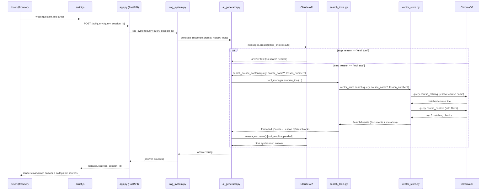

# Course Materials RAG Chatbot

A full-stack web app that lets users ask questions about course materials using Retrieval-Augmented Generation (RAG).

---

## Getting Started

### Prerequisites

- Python 3.13+
- `uv` package manager
- Anthropic API key

### Setup (one-time)

1. Create a `.env` file in the project root:

   ```
   ANTHROPIC_API_KEY=your_anthropic_api_key_here
   ```

2. Install dependencies:
   ```bash
   uv sync
   ```

### Start the app

```bash
./run.sh
```

Or manually:

```bash
cd backend && uv run uvicorn app:app --reload --port 8000
```

- Web UI: `http://localhost:8000`
- API docs: `http://localhost:8000/docs`

---

## Architecture

```
User Browser → FastAPI Backend → ChromaDB (vector search) → Claude AI (response)
```

## Query Flow Diagram (ASCII)

```
USER BROWSER
     │
     │  types question, hits Enter
     ▼
  script.js
     │
     │  POST /api/query {query, session_id}
     ▼
   app.py  (FastAPI)
     │
     │  rag_system.query(query, session_id)
     ▼
 rag_system.py
     │
     │  generate_response(prompt, history, tools)
     ▼
 ai_generator.py
     │
     │  messages.create() [tool_choice: auto]
     ▼
  Claude API
     │
     ├─── stop_reason == "end_turn" ──────────────────────┐
     │    (answers from general knowledge)                 │
     │                                                     │
     └─── stop_reason == "tool_use" ──┐                   │
          (needs to search)           │                    │
                                      ▼                    │
                              search_tools.py              │
                                      │                    │
                                      │  vector_store      │
                                      │  .search(...)      │
                                      ▼                    │
                              vector_store.py              │
                                      │                    │
                              ┌───────┴───────┐            │
                              ▼               ▼            │
                        course_catalog  course_content     │
                         (resolve name)  (top 5 chunks)    │
                              └───────┬───────┘            │
                                      ▼                    │
                            formatted [Course - Lesson N]  │
                            text blocks appended           │
                                      │                    │
                                      ▼                    │
                              2nd Claude call              │
                              (synthesize answer)          │
                                      │                    │
                                      ▼                    │
                               final answer ◄──────────────┘
                                      │
     ◄────────────────────────────────┘
     │  {answer, sources, session_id}
     ▼
  script.js
     │
     ▼
USER BROWSER
  renders markdown answer
  + collapsible sources
```

## Query Flow Diagram (Mermaid)



## Backend (`/backend`)

| File                    | Purpose                                                                                                                                                                          |
| ----------------------- | -------------------------------------------------------------------------------------------------------------------------------------------------------------------------------- |
| `app.py`                | FastAPI server with 2 endpoints: `POST /api/query` and `GET /api/courses`. Serves the frontend as static files. Loads docs from `/docs` on startup.                              |
| `rag_system.py`         | Main orchestrator — wires all components together. Handles document ingestion and query processing.                                                                              |
| `ai_generator.py`       | Wraps the Anthropic Claude API (`claude-sonnet-4-20250514`). Implements a tool-use loop: Claude decides when to search, the search runs, then Claude synthesizes a final answer. |
| `vector_store.py`       | ChromaDB wrapper with two collections: `course_catalog` (metadata) and `course_content` (chunked text). Uses `all-MiniLM-L6-v2` sentence embeddings.                             |
| `document_processor.py` | Parses `.txt`/`.pdf`/`.docx` files in a structured format (Course Title/Link/Instructor header + `Lesson N: Title` markers), then chunks text with configurable size/overlap.    |
| `search_tools.py`       | Defines `CourseSearchTool` — an Anthropic-compatible tool definition for `search_course_content`. Claude calls this with a query + optional course name/lesson number filters.   |
| `session_manager.py`    | Manages per-session conversation history (last 2 exchanges by default).                                                                                                          |
| `models.py`             | Pydantic models: `Course`, `Lesson`, `CourseChunk`.                                                                                                                              |
| `config.py`             | Central config: API key from `.env`, model name, chunk size (800), overlap (100), max results (5).                                                                               |

## Frontend (`/frontend`)

Vanilla HTML/CSS/JS. Chat UI with:

- Message thread with markdown rendering (via `marked.js`)
- Collapsible source citations per response
- Sidebar showing loaded course count and titles
- Suggested question buttons

## Data (`/docs`)

4 course transcript `.txt` files (`course1_script.txt` through `course4_script.txt`) that get loaded into ChromaDB on startup.

---

## Document Processing

### 1. Parse the header (first 3 lines)

Each file must start with:

```
Course Title: Introduction to MCP
Course Link: https://...
Course Instructor: Jane Doe
```

### 2. Split into lessons

The processor scans line-by-line for `Lesson N: Title` markers (e.g. `Lesson 1: Getting Started`). Optionally, the line immediately after a lesson marker can be `Lesson Link: https://...`.

Each lesson's text content is collected until the next lesson marker is hit.

### 3. Chunk the lesson text

Each lesson's content is split into overlapping text chunks:

- **Chunk size**: 800 characters
- **Overlap**: 100 characters
- Splitting is sentence-aware — it avoids cutting mid-sentence using a regex that detects sentence endings (`.`, `!`, `?`) followed by a capital letter

### 4. Store in ChromaDB

Two things are stored per course:

- **`course_catalog`** — one entry with the course title, instructor, link, and lesson list (serialized as JSON)
- **`course_content`** — one entry per chunk, tagged with `course_title`, `lesson_number`, and `chunk_index`. The first chunk of each lesson gets a `"Lesson N content: ..."` prefix to add context.

### 5. Skip duplicates on restart

On startup, `add_course_folder` fetches existing course titles from ChromaDB and skips any file whose course title is already present — so re-running the server won't re-index everything.

---

## Request Flow

### 1. Frontend — `script.js`

User hits Enter or clicks Send → `sendMessage()`:

- Disables input, appends the user's message bubble and a loading spinner to the chat
- Fires `POST /api/query` with JSON body: `{ query, session_id }`

### 2. FastAPI — `app.py` `POST /api/query`

- If no `session_id` in the request, creates a new one via `session_manager.create_session()`
- Calls `rag_system.query(query, session_id)`

### 3. RAG Orchestrator — `rag_system.py` `query()`

- Wraps the query: `"Answer this question about course materials: {query}"`
- Fetches conversation history for the session from `SessionManager`
- Calls `ai_generator.generate_response(prompt, history, tools, tool_manager)`

### 4. AI Generator — `ai_generator.py` `generate_response()`

- Builds the system prompt (with conversation history appended if present)
- Calls Claude (`claude-sonnet-4-20250514`) with `tool_choice: auto` and the `search_course_content` tool available
- **Two possible outcomes:**
  - `stop_reason == "end_turn"` → Claude answered from general knowledge, return text directly
  - `stop_reason == "tool_use"` → Claude wants to search, calls `_handle_tool_execution()`

### 5. Tool Execution — `ai_generator.py` `_handle_tool_execution()`

- Appends Claude's tool-use request to the message history
- Calls `tool_manager.execute_tool("search_course_content", query, course_name?, lesson_number?)`
- That delegates to `CourseSearchTool.execute()` → `VectorStore.search()`

### 6. Vector Search — `vector_store.py` `search()`

- If `course_name` provided: fuzzy-resolves it via semantic search on `course_catalog` collection
- Builds a ChromaDB `where` filter (`course_title`, `lesson_number`, or both)
- Queries the `course_content` collection for the top 5 matching chunks
- Returns documents + metadata (course title, lesson number)

### 7. Back up the chain

- `CourseSearchTool` formats results as `[Course - Lesson N]\n<text>` blocks, stores source labels
- Tool result is appended to the message thread as a `tool_result` message
- A **second Claude call** is made (without tools this time) to synthesize the search results into a final answer

### 8. Response bubbles back

- `ai_generator` returns the final answer string
- `rag_system` retrieves source labels from `tool_manager.get_last_sources()`, resets them, updates session history
- `app.py` returns `{ answer, sources, session_id }`
- Frontend removes the loading spinner, renders the answer as markdown, and shows sources in a collapsible `<details>` element

testin
PR codereview
